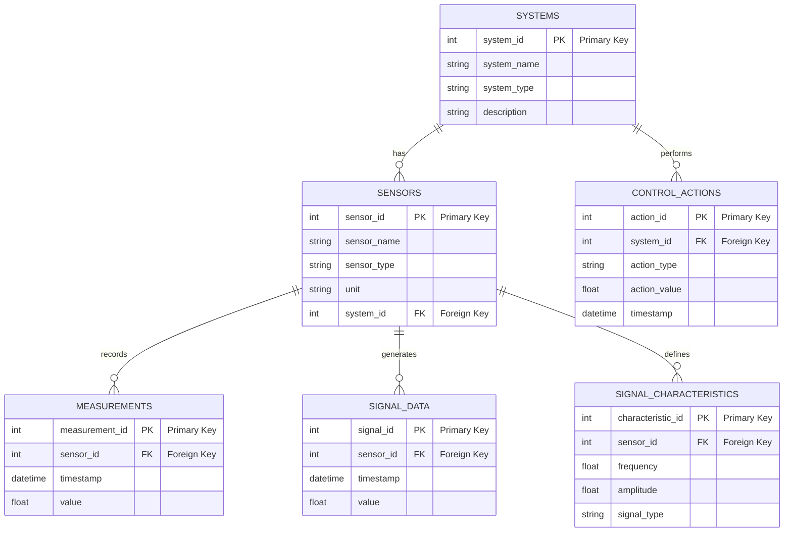

```mermaid
erDiagram
    SYSTEMS {
        int system_id PK "Primary Key"
        string system_name
        string system_type
        string description
    }

    SENSORS {
        int sensor_id PK "Primary Key"
        string sensor_name
        string sensor_type
        string unit
        int system_id FK "Foreign Key"
    }

    MEASUREMENTS {
        int measurement_id PK "Primary Key"
        int sensor_id FK "Foreign Key"
        datetime timestamp
        float value
    }

    CONTROL_ACTIONS {
        int action_id PK "Primary Key"
        int system_id FK "Foreign Key"
        string action_type
        float action_value
        datetime timestamp
    }

    SIGNAL_DATA {
        int signal_id PK "Primary Key"
        int sensor_id FK "Foreign Key"
        datetime timestamp
        float value
    }

    SIGNAL_CHARACTERISTICS {
        int characteristic_id PK "Primary Key"
        int sensor_id FK "Foreign Key"
        float frequency
        float amplitude
        string signal_type
    }

    SYSTEMS ||--o{ SENSORS : has
    SENSORS ||--o{ MEASUREMENTS : records
    SENSORS ||--o{ SIGNAL_DATA : generates
    SENSORS ||--o{ SIGNAL_CHARACTERISTICS : defines
    SYSTEMS ||--o{ CONTROL_ACTIONS : performs


```