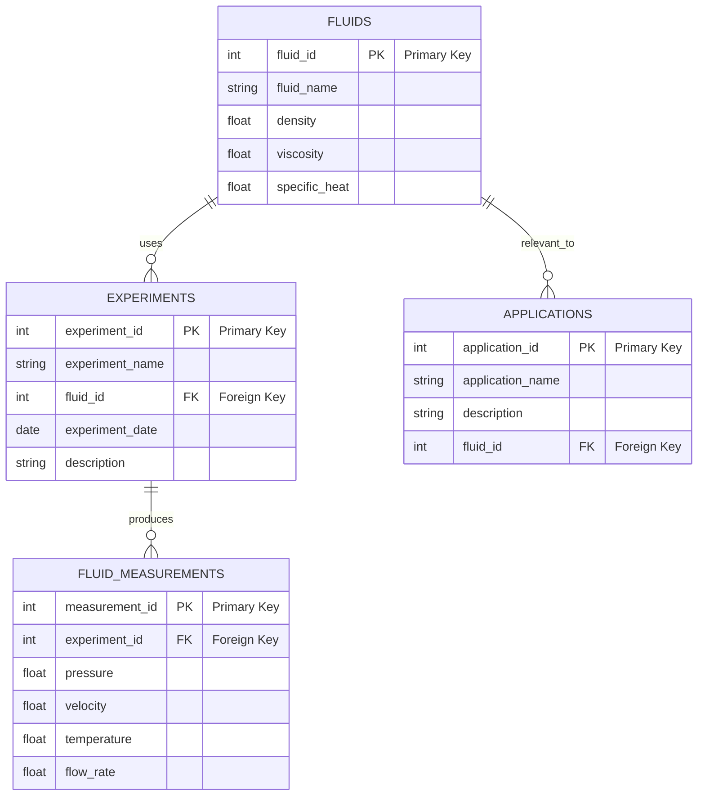

```mermaid
erDiagram
    FLUIDS {
        int fluid_id PK "Primary Key"
        string fluid_name
        float density
        float viscosity
        float specific_heat
    }

    EXPERIMENTS {
        int experiment_id PK "Primary Key"
        string experiment_name
        int fluid_id FK "Foreign Key"
        date experiment_date
        string description
    }

    FLUID_MEASUREMENTS {
        int measurement_id PK "Primary Key"
        int experiment_id FK "Foreign Key"
        float pressure
        float velocity
        float temperature
        float flow_rate
    }

    APPLICATIONS {
        int application_id PK "Primary Key"
        string application_name
        string description
        int fluid_id FK "Foreign Key"
    }

    FLUIDS ||--o{ EXPERIMENTS : uses
    FLUIDS ||--o{ APPLICATIONS : relevant_to
    EXPERIMENTS ||--o{ FLUID_MEASUREMENTS : produces


```